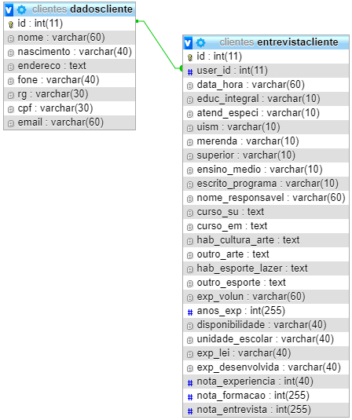

# CadastroEducador

## Tutorial

1 - Possuir WAMP Server instalado no pc


[DOWNLOAD](https://sourceforge.net/projects/wampserver/files/latest/download?source=files)

2 - Baixar repositório

3 - Colocar repositório na pasta www aonde foi instalado o wamp server

4 - Criar banco de dados chamado clientes

5 - Criar 2 tabelas a partir deste [código SQL](DataBase.txt)
```
CREATE TABLE `clientes`.`entrevistacliente` ( `id` INT NOT NULL AUTO_INCREMENT , `user_id` INT NOT NULL , `data_hora` VARCHAR(60) NOT NULL , `educ_integral` VARCHAR(10) NOT NULL ,`atend_especi` VARCHAR(10) NOT NULL ,`uism` VARCHAR(10) NOT NULL,`merenda` VARCHAR(10) NOT NULL, `superior` VARCHAR(10) NOT NULL , `ensino_medio` VARCHAR(10) NOT NULL , `escrito_programa` VARCHAR(10) NOT NULL , `nome_responsavel` VARCHAR(60) NOT NULL , `curso_su` TEXT NOT NULL , `curso_em` TEXT NOT NULL , `hab_cultura_arte` TEXT NOT NULL , `outro_arte` TEXT NOT NULL , `hab_esporte_lazer` TEXT NOT NULL , `outro_esporte` TEXT NOT NULL , `exp_volun` VARCHAR(60) NOT NULL , `anos_exp` INT(255) NOT NULL , `disponibilidade` VARCHAR(40) NOT NULL , `unidade_escolar` VARCHAR(40) NOT NULL , `exp_lei` VARCHAR(40) NOT NULL , `exp_desenvolvida` VARCHAR(40) NOT NULL , `nota_experiencia` INT(40) NOT NULL , `nota_formacao` INT(255) NOT NULL , `nota_entrevista` INT(255) NOT NULL , PRIMARY KEY (`id`), INDEX (`user_id`)) ENGINE = InnoDB;


CREATE TABLE `clientes`.`dadoscliente` ( `id` INT NOT NULL AUTO_INCREMENT , `nome` VARCHAR(60) NOT NULL , `nascimento` VARCHAR(40) NOT NULL , `endereco` TEXT NOT NULL , `fone` VARCHAR(40) NOT NULL , `rg` VARCHAR(30) NOT NULL , `cpf` VARCHAR(30) NOT NULL , `email` VARCHAR(60) NOT NULL , PRIMARY KEY (`id`)) ENGINE = InnoDB;
```

6 - Criar relação em cascata entre o id da tabela dadoscliente com o user_id da tabela entrevistacliente



7 - Abrir no http://localhost/CadastroEducador/

8 - Seja feliz
